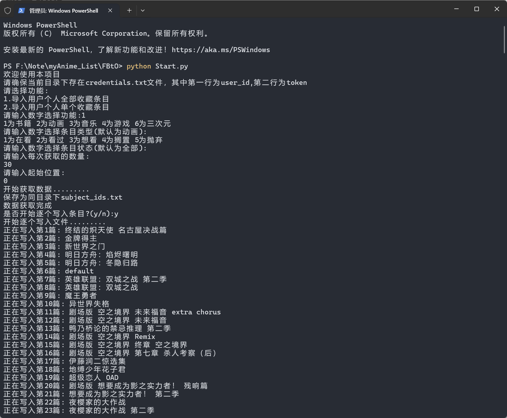
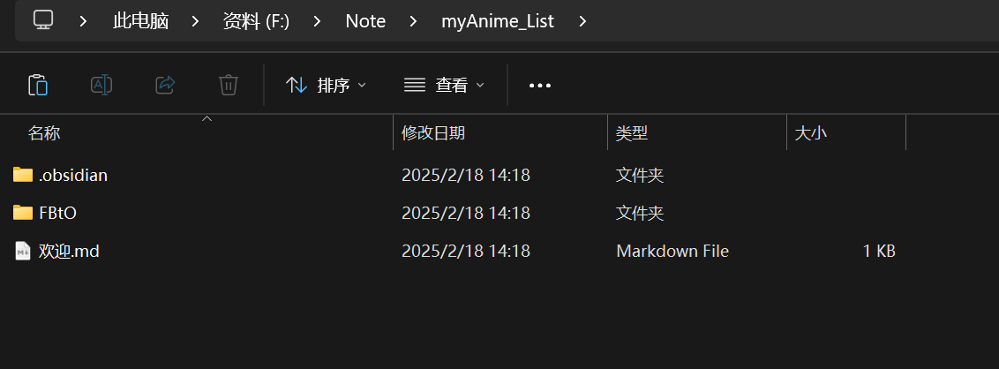
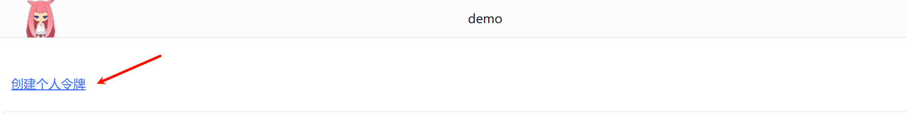
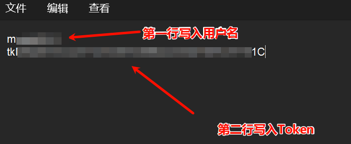
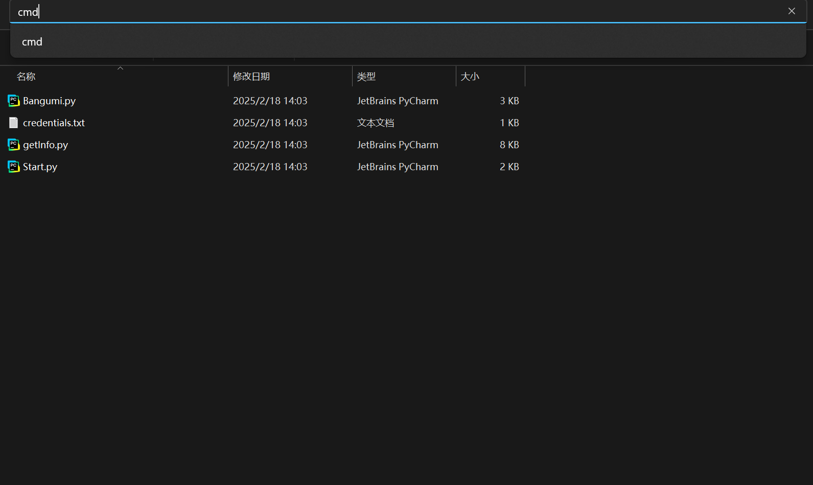

# From-Bangumi-to-Obsidian
快速从Bangumi导出条目信息至Obsidian,进而搭建本地动漫库

## 项目功能:

- 获取对应条目相关公开信息

- 获取用户个人收藏信息。

- 自动生成Markdown文件,跳过本地已有文件，写入条目属性、个人收藏信息、制作人员、出演角色、关联条目

  自动将Bangumi条目的公开标签和个人标签合并,切分后导入，进而生成Obsidian关系图谱(Obsidian自带)

- 自动与本地已有条目关联,实现正反双向链接

## 项目示例：

## 前置需求:

本地Python环境

## 使用方法:

1. 前往Release界面,下载最新.zip文件,解压缩。

2. 新建Obsidian项目，将文件移入Obsidian项目内

   

3. 前往Bangumi生成个人 [Access Token](images/image-20250218135108607.png)

   

4. 进入软件根目录，打开 credentials.txt ，严格按照对应行，写入个人**用户名**及**Token**，保存文件

   

5. 打开项目根目录，上方地址栏调用cmd/powershell

   

6. 输入`python Start.py`

7. 依照提示进行选择即可（offect填写为0即可）

## 获取条目ID:

进入Bangumi对应条目界面,上方地址栏`https://bangumi.tv/subject/*或https://bgm.tv/subject/*`*即为条目ID

## 可能出现的问题：

### 出现Default.md条目:

此条目为**NSFW**条目，请手动导入（似乎可以通过Bangumi开发者平台创建应用来获取授权，待开发）

### 程序正常启动，但当开始获取信息时报错：

检查你的用户名和Token是否填写正确，Token是否过期。

### 某些条目排版错误：

某些条目可能缺少某些参数等个别情况，需要收集数据统一完善，暂时先个人手动调整

## 待完善内容：

- 个别条目参数变化导致自动排版错误
- Default条目导入的实现
- 实现条目的更新功能

## 如有问题，欢迎在Issue上提问
