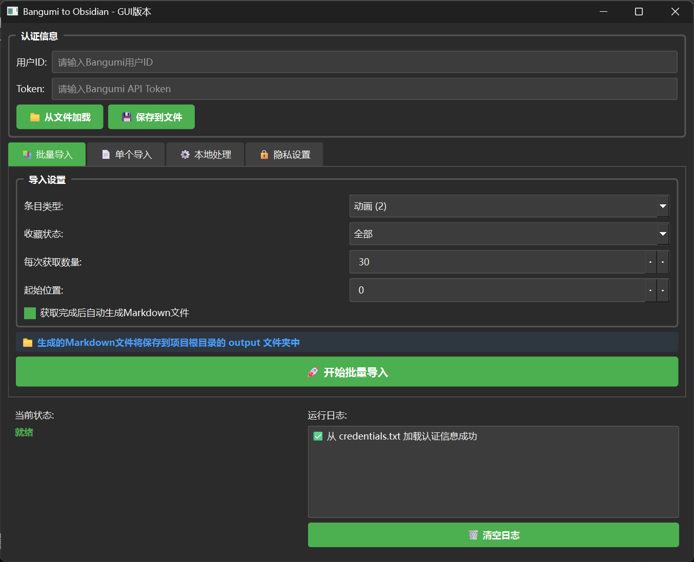
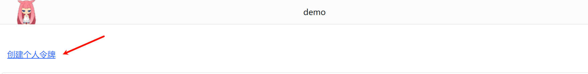
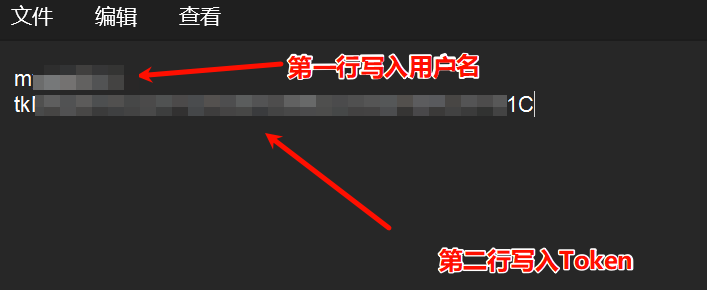
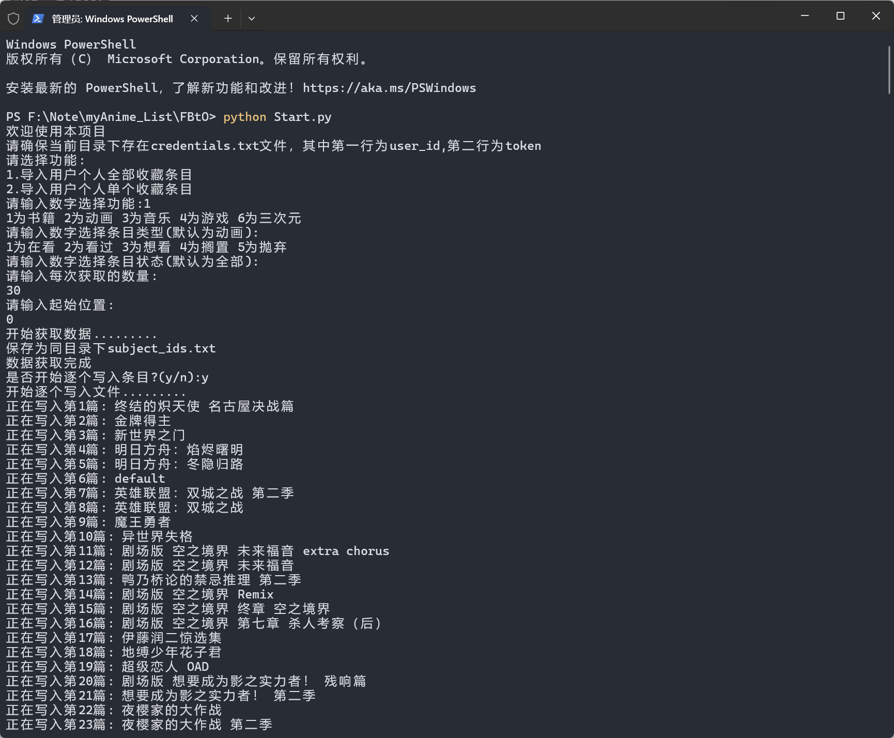

# From-Bangumi-to-Obsidian

快速从Bangumi导出条目信息，生成对应Markdown文件，导入至Obsidian等笔记软件，进而搭建本地动漫库。

## 🎯 项目特色

- **双版本支持**: 提供现代化GUI界面和传统命令行界面
- **智能导出**: 获取条目完整信息，包括个人收藏信息和条目公开数据
- **自动生成**: 创建结构化Markdown文件，包含详细元数据和图片
- **标签融合**: 自动合并Bangumi公开标签和个人自建标签
- **双向链接**: 支持Obsidian等笔记软件的关联功能
- **批量处理**: 支持大量条目的批量导入和处理
- **隐私管理**: 一键调整全部条目的隐私状态

## 🚀 快速开始

### GUI版本（推荐）
1. 双击运行 `启动GUI.bat`（Windows）或 `python run_gui.py`
2. 在界面中输入用户名和API Token
3. 选择功能开始使用

### 命令行版本
1. 配置 `credentials.txt` 文件
2. 运行 `python src/Start.py`
3. 按提示选择功能

## 项目示例：




## 📝 详细使用方法

前往最新release界面下载FBTO.zip文件

### ⚙️ 环境要求

- **Python 3.7+**
- **依赖包**: PyQt6, requests（程序会自动检测并安装）
- **网络连接**: 需要访问Bangumi API

### 准备工作

1. **获取API Token**
   
   - 前往 [Bangumi Access Token](https://next.bgm.tv/demo/access-token) 页面
   - 生成你的个人API Token
   
   
   
2. **配置认证信息**
   - 打开 `credentials.txt` 文件
   - 第一行填入你的用户名
   - 第二行填入API Token
   
   

### GUI版本使用（推荐）

1. **启动程序**
   - Windows用户：双击 `启动GUI.bat`
   - 其他用户：运行 `python run_gui.py`

2. **配置认证**
   - 在界面顶部输入用户名和Token
   - 点击"保存到文件"或"从文件加载"

3. **选择功能**
   - **📚 批量导入**: 获取收藏列表，保存所有条目的id，并生成Markdown
   - **📄 单个导入**: 处理指定条目ID
   - **⚙️ 本地处理**: 处理本地已有的条目ID列表
   - **🔒 隐私设置**: 批量修改条目隐私状态

4. **文件输出**
   - 所有生成的Markdown文件保存在 `output/` 文件夹中
   - 可直接导入到Obsidian等笔记软件

### 命令行版本使用

1. **启动程序**
   
   ```bash
   python src/Start.py
   ```
   
2. **选择功能**
   
   ```
   1. 导入用户个人全部收藏条目
   2. 导入用户个人单个收藏条目  
   3. 根据本地subject_ids.txt文件逐个写入条目
   4. 修改全部条目隐私设置
   ```
   
3. **按提示操作**
   - 选择条目类型（书籍/动画/音乐/游戏/三次元）
   - 设置获取参数（数量、起始位置等）

## 🔍 获取条目ID

进入Bangumi对应条目页面，地址栏中的数字即为条目ID：
`https://bangumi.tv/subject/[条目ID]` 或 `https://bgm.tv/subject/[条目ID]`


## 📄 生成的文件内容

每个Markdown文件包含：

- **基础信息**: 原名、话数、评分、观看状态等
- **个人数据**: 个人评分、评论、收藏日期
- **剧情梗概**: 条目简介
- **制作人员**: 导演、制作团队信息（含头像）
- **出演角色**: 主要角色及配音演员（含头像）
- **关联条目**: 相关作品的双向链接
- **封面图片**: 高清封面展示

## 📊 项目示例

### 脚本运行界面


### 生成的Markdown文件


## 🛠️ 故障排除

### Default.md 条目出现
此为NSFW条目，API无法直接获取详细信息，需要手动处理。

### API请求失败
1. 检查用户名和Token是否正确
2. 确认Token未过期
3. 检查网络连接状态
4. 验证Bangumi API服务可用性

### 条目信息不完整
某些条目可能缺少部分参数，程序会跳过缺失字段，请手动补充。

### 文件编码问题
程序使用UTF-8编码，确保系统支持中文字符显示。

### 运行启动.bat文件后报错

检测本地有无环境，Pyqt等第三方软件包是否安装。

## 🚧 开发计划

- [ ] 支持更多条目类型的完整信息获取
- [ ] 优化NSFW条目的处理方式  
- [ ] 增加更多导出格式选项
- [ ] 提供更多自定义模板
- [ ] 添加数据校验和修复功能

## 🤝 贡献指南

欢迎提交Issue和Pull Request来改进项目！

如有问题或建议，请在 [Issues页面](https://github.com/LCMs-YoRHa/From-Bangumi-to-Obsidian/issues) 提出。


## **本项目免费开源，不可商用！**
